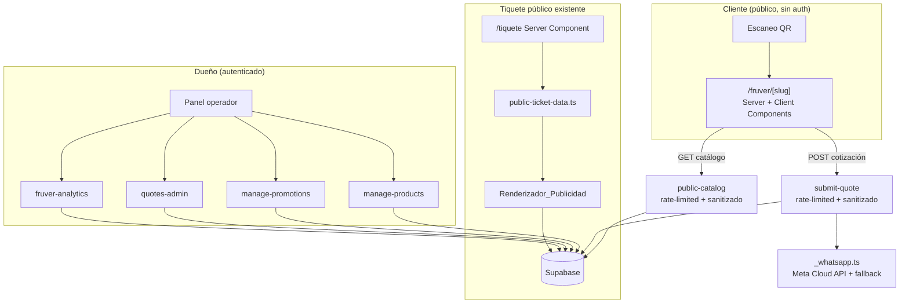

# Documento de Diseño: fruver-catalog-quoting

## Overview

`fruver-catalog-quoting` incorpora la vertical **"fruver"** (tienda de frutas y verduras) a la plataforma multi-vertical TiqueteVivo (Next.js App Router + Supabase). El negocio piloto es **Fruver Patty**. La funcionalidad convierte cada tiquete digital en un canal de publicidad continua y añade dos capacidades nuevas al ecosistema existente:

1. **Catálogo de productos con precio del día** administrado por el Dueño desde el panel.
2. **Página pública de cotización** donde el Cliente arma su mercado, obtiene un Total_Estimado y lo envía por WhatsApp, con soporte de **listas de compra frecuente** y **analítica del piloto**.

### Principio rector: reutilizar, no reinventar

El diseño se apoya estrictamente en los bloques ya existentes de la plataforma. La siguiente tabla resume qué se reutiliza y cómo:

| Bloque existente | Archivo | Uso en esta feature |
|---|---|---|
| Registro de verticales y defaults | `lib/api/_vertical-config.ts` (`getVerticalBySlug`, `applyVerticalDefaults`) | Seed de la vertical "fruver" y aplicación de sus defaults al asociar un negocio |
| Clientes (único por `business_id + phone`) | `lib/api/_customers.ts` (`upsertCustomer`) | Asociar cotizaciones y listas frecuentes a un Cliente sin incrementar el contador de pedidos |
| Tiquete público sanitizado | `lib/api/public-ticket-data.ts` + `app/tiquete/page.tsx` | El Renderizador_Publicidad se integra aquí respetando la lista blanca de sanitización |
| WhatsApp + motor de plantillas | `lib/api/_whatsapp.ts`, `lib/api/_template-engine.ts` (`buildFallbackLink`, `selectTemplate`, `renderTemplate`) | Envío de cotizaciones por WhatsApp con enlace de respaldo |
| Configuración de negocio (JSONB) | columnas `payment_config`, `loyalty_config`, `status_flow_config`, `custom_fields_config` en `businesses` | Se agregan `product_catalog_config` y `promotions_config` con el mismo patrón |
| Rate limiting | `lib/api/_rate-limiter.ts` (`checkRateLimit`) + `getClientIp` de `_utils.ts` | Protección de endpoints públicos de catálogo y cotización |
| Almacenamiento de fotos | `lib/api/_photo-storage.ts` (bucket `order-photos`, `uploadPhoto`, `getSignedPhotoUrl`) | Foto opcional de producto |
| Wrapper de rutas | `lib/api/netlify-adapter.ts` (`netlifyHandler`), `impl.ts` + `route.ts` | Estructura de todos los endpoints nuevos |
| Auth y permisos | `lib/api/_utils.ts` (`requireAuth`, `getBusinessBySlug`, `json`, `parseBody`, `getClientIp`) | Autorización de endpoints del panel y contexto de negocio |
| Validadores | `lib/api/_validators.ts` (`validateAmount`, `validatePhone`, `validateRequired`) | Validación de precios, teléfonos y campos obligatorios |

### Alcance funcional (mapa de requisitos)

- **R1** Registro de la vertical fruver → migración de seed + `applyVerticalDefaults`.
- **R2** CRUD de catálogo de productos → tabla `products` + `Gestor_Catalogo` (`manage-products`).
- **R3** Gestión de promociones → `promotions_config` / tabla `promotions` + `Gestor_Promociones` (`manage-promotions`).
- **R4** Publicidad integrada en el tiquete → `Renderizador_Publicidad` sobre `public-ticket-data.ts`.
- **R5** Página pública de catálogo y cotización → `/fruver/[slug]` + endpoint público `public-catalog`.
- **R6** Envío de cotización por WhatsApp → `Gestor_Cotizaciones` (`submit-quote`) + módulo WhatsApp.
- **R7** Persistencia y seguimiento de conversión → tabla `quotes` + endpoints del panel.
- **R8** Listas de compra frecuente → tabla `frequent_lists`.
- **R9** Analítica del piloto → endpoint `fruver-analytics`.
- **R10, R11, R12** No funcionales → rate limiting, sanitización, rendimiento y aislamiento multi-tenant transversales.

## Architecture

### Diagrama de contexto



### Patrón de endpoints

Todos los endpoints nuevos siguen el patrón vigente del repositorio:

- `app/api/<nombre>/impl.ts`: exporta `handler(event: NetlifyEvent): Promise<NetlifyResponse>` con la lógica.
- `app/api/<nombre>/route.ts`: `export const POST = netlifyHandler(handler)` (y `GET` cuando aplique).
- Respuestas siempre con `json(status, body)`.
- Autenticación del panel con `requireAuth(supabase, event, { permission, businessId })`.
- Cliente Supabase de servicio con `supabaseAdmin()`.

Endpoints nuevos:

| Endpoint | Método | Auth | Rate limit | Responsabilidad |
|---|---|---|---|---|
| `api/manage-products` | POST | Sí (`manage_business`) | No | CRUD de productos (`create`, `update`, `deactivate`, `list`) — R2 |
| `api/manage-promotions` | POST | Sí (`manage_business`) | No | CRUD de promociones/combos/códigos (`create`, `update`, `deactivate`, `list`) — R3 |
| `api/public-catalog` | GET | No | Sí | Catálogo activo + promociones vigentes por `slug` (sanitizado) — R5, R10, R11 |
| `api/submit-quote` | POST | No | Sí | Persistir cotización + enviar WhatsApp + upsertCustomer — R6, R7 |
| `api/frequent-lists` | POST | No (por `slug + phone`) | Sí | Guardar/cargar lista frecuente — R8 |
| `api/quotes-admin` | POST | Sí (`manage_business`) | No | Listar cotizaciones y marcar conversión — R7 |
| `api/fruver-analytics` | GET/POST | Sí (`read`) | No | Métricas agregadas por `business_id` y rango — R9 |

> Nota de reutilización: la publicidad en el tiquete público **no** agrega un endpoint nuevo. Se compone dentro de `public-ticket-data.ts` (misma fuente sanitizada que alimenta `/tiquete` y `api/public-ticket`), evitando divergencias.

### Frontend

- **Panel del Dueño**: nuevas vistas dentro de `app/panel/` para gestionar catálogo, promociones, ver cotizaciones y analítica. Se apoyan en los endpoints autenticados.
- **Página pública de cotización**: `app/fruver/[slug]/page.tsx` como Server Component que hace el fetch inicial del catálogo (SSR, ≤2 s por R11) y delega a un Client Component (`QuoteBuilder`) el cálculo del Total_Estimado en el navegador sin round-trips por cada cambio (R11.2).
- El cálculo del Total_Estimado vive en un módulo puro compartido `lib/fruver/quote-calculator.ts` para poder testearlo por propiedades sin DOM.

### Decisiones de diseño y justificación

1. **Productos en tabla dedicada `products`, no en JSONB.** A diferencia de `services_config` (pocos servicios, semi-estáticos), un catálogo fruver puede llegar a ~200 productos con precios que cambian a diario (R11). Una tabla relacional con índice por `business_id` y `active` permite consultas eficientes y actualizaciones puntuales del precio del día. Se mantiene el patrón multi-tenant (`business_id`) de `customers`/`orders`.
2. **`product_catalog_config` y `promotions_config` como JSONB en `businesses`** solo para *configuración* de la vertical (habilitación, invitación a redes/canal de difusión, textos), no para los datos transaccionales. Esto respeta el mandato de R1.4 y R4.4 reutilizando el patrón de `payment_config`/`loyalty_config`.
3. **Promociones (banner, combo, código) en tabla dedicada `promotions`** con un discriminador `type`. Comparten ventana de validez y estado activo; un combo referencia productos vía JSONB de líneas. Esto simplifica la consulta de "promociones vigentes" (R3.7) con un único filtro por fecha y estado.
4. **Total_Estimado calculado en el cliente y recalculado en el servidor al persistir.** El cliente da respuesta inmediata (R11.2); el servidor recalcula con precios vigentes al persistir la cotización para que el registro sea confiable e independiente de manipulación del cliente (R5.3, R6.1, R12). Ambos usan el mismo módulo puro.
5. **Sanitización centralizada.** Los endpoints públicos y el renderizador de publicidad usan una única función de whitelisting (`toPublicProduct`, `toPublicPromotion`) análoga a `stripSensitiveOrderFields`, garantizando que nunca se filtren campos internos (R4.6, R5.6, R10.3).
6. **`upsertCustomer` con `incrementOrder: false`.** Una cotización no es una compra; asociar el Cliente sin inflar `orders_count` mantiene la integridad de la analítica de retención existente (R6.5).

## Components and Interfaces

### Gestor_Catalogo — `app/api/manage-products/impl.ts`

Reutiliza el patrón de `manage-business/impl.ts` (acciones por `action`, autorización, validación).

```ts
type ProductAction = "create" | "update" | "deactivate" | "list";
const VALID_UNITS = ["kg", "libra", "unidad"] as const; // R2.2

interface ManageProductsBody {
  action: ProductAction;
  business_id: string;
  product?: {
    id?: string;
    name?: string;
    unit?: "kg" | "libra" | "unidad";
    day_price?: number;      // >= 0, numérico (R2.4)
    photo_url?: string | null;
    photo_base64?: string | null; // se sube con uploadPhoto (R2.6)
    is_seasonal?: boolean;   // indicador de temporada (R2.8)
    active?: boolean;
  };
  product_id?: string; // para deactivate
}
```

Reglas:
- `create`: valida `name` no vacío (`validateRequired`), `unit ∈ VALID_UNITS` (R2.3), `day_price` con `validateAmount` (R2.4), persiste con `business_id` y `active = true` (R2.1). Foto opcional vía `uploadPhoto` (R2.6).
- `update`: valida los campos presentes, guarda cambios y actualiza `updated_at` (R2.5).
- `deactivate`: pone `active = false` conservando la fila (R2.7).
- `list`: devuelve productos filtrados por el `business_id` autenticado (R2.9, R12.1).

### Gestor_Promociones — `app/api/manage-promotions/impl.ts`

```ts
type PromotionAction = "create" | "update" | "deactivate" | "list";
type PromotionType = "banner" | "combo" | "discount_code";

interface PromotionInput {
  type: PromotionType;
  text?: string;                 // banner (R3.1)
  discount_percent?: number;     // combo / código: 0..100 (R3.5)
  code?: string;                 // discount_code (R3.3)
  product_ids?: string[];        // combo (R3.2)
  starts_at: string;             // ISO date
  ends_at: string;               // ISO date, debe ser >= starts_at (R3.4)
}
```

Reglas:
- Valida `ends_at >= starts_at` (R3.4) y `0 <= discount_percent <= 100` para combos/códigos (R3.5).
- `deactivate` marca `active = false` para excluir del renderizador (R3.6).
- `getActivePromotions(supabase, businessId, now)`: devuelve solo activas cuya `now ∈ [starts_at, ends_at]` (R3.7). Función compartida con el Renderizador_Publicidad.

### Renderizador_Publicidad — módulo `lib/fruver/advertising.ts`

Función pura de composición usada dentro de `public-ticket-data.ts`:

```ts
interface AdvertisingBlocks {
  promotions: PublicPromotion[];   // banners vigentes (R4.1)
  seasonal: PublicProduct[];       // productos con is_seasonal (R4.2)
  combos: PublicCombo[];           // combos vigentes (R4.3)
  socialInvite: string | null;    // desde promotions_config (R4.4)
  discountCode: PublicDiscountCode | null; // código vigente (R4.5)
}

// Devuelve solo bloques no vacíos; si no hay nada vigente, todos null/[] (R4.7)
function buildAdvertisingBlocks(input: {
  vertical_slug: string;           // solo compone para "fruver"
  products: Product[];
  promotions: Promotion[];
  promotionsConfig: any;
  now: Date;
}): AdvertisingBlocks;
```

Se integra en `getPublicTicket`: cuando `vertical_slug === "fruver"`, se añade `advertising: AdvertisingBlocks` al objeto `data` devuelto, compuesto **exclusivamente** con datos ya sanitizados (R4.6). El Server Component `/tiquete` renderiza los bloques presentes.

### Página pública de cotización — `app/fruver/[slug]/page.tsx` + `QuoteBuilder`

- **Server Component**: llama a `getPublicCatalog(slug)` (SSR) y pasa el catálogo sanitizado + promociones vigentes al Client Component. Muestra aviso explícito de que el total es estimado (R5.5).
- **`QuoteBuilder` (Client Component)**: gestiona selección y cantidades, valida cantidad `> 0` y numérica (R5.4), recalcula Total_Estimado localmente (R11.2) usando `lib/fruver/quote-calculator.ts`. Permite guardar/cargar Lista_Frecuente y enviar por WhatsApp.

### Calculadora de cotización — `lib/fruver/quote-calculator.ts` (módulo puro)

```ts
interface QuoteLine { product_id: string; name: string; unit: string; day_price: number; qty: number; }

// Total = Σ (day_price * qty) sobre líneas con qty > 0 (R5.3)
function computeEstimatedTotal(lines: QuoteLine[]): number;

// Filtra cantidades inválidas (<= 0 o no numéricas) (R5.4)
function sanitizeQuantities(lines: QuoteLine[]): { valid: QuoteLine[]; rejected: QuoteLine[] };

// Reconstruye líneas desde una lista frecuente contra el catálogo actual,
// omitiendo productos inactivos/inexistentes (R8.4) y recalculando precios (R8.3)
function reconcileFrequentList(
  saved: { product_id: string; qty: number }[],
  catalog: Product[]
): { lines: QuoteLine[]; unavailable: string[] };
```

### Endpoint público de catálogo — `app/api/public-catalog/impl.ts`

- `GET` con `slug` en query. Aplica `checkRateLimit("{ip}:public-catalog", limit, windowMs)` usando `getClientIp` (R10.1, R10.2).
- Resuelve negocio con `getBusinessBySlug`, verifica vertical fruver.
- Devuelve **solo** productos `active = true` (R5.1, R11.3) y promociones vigentes, ambos pasados por `toPublicProduct`/`toPublicPromotion` (R5.6, R10.3).
- Valida `slug` antes de consultar (R10.4).

### Gestor_Cotizaciones — `app/api/submit-quote/impl.ts`

- `POST` público, rate-limited (R10.1). Valida entradas antes de tocar la BD (R10.4): cada línea con `qty > 0`, `product_id` perteneciente al negocio del `slug` (R12.2), teléfono opcional con `validatePhone`.
- Recalcula Total_Estimado en servidor con precios vigentes y persiste `quote` con estado `"enviada"` y `created_at` (R6.1, R7.1).
- Si hay teléfono: `upsertCustomer(..., { incrementOrder: false })` y asocia `customer_id` (R6.5).
- Construye mensaje legible (lista de productos, cantidades, total) con el motor de plantillas y `sendWhatsAppMessage`; ante fallo/API no disponible devuelve `buildFallbackLink` con el contenido (R6.2, R6.3, R6.4).

### Endpoints del panel

- `quotes-admin`: `list` (filtra por `business_id`, R7.4) y `mark-converted` (estado `"convertida"` + `converted_at`, opcional `order_id`, R7.2, R7.3). Nunca elimina (R7.5).
- `fruver-analytics`: dado un rango, devuelve cotizaciones por semana (R9.1), % de conversión con guarda anti-división por cero (R9.2, R9.5), recompras con lista frecuente (R9.3) y Total_Estimado promedio (R9.4); todo aislado por `business_id` (R9.6, R12.1).

### `frequent-lists` — `app/api/frequent-lists/impl.ts`

- `save`: persiste líneas asociadas a Cliente (`upsertCustomer` sin incrementar) y `business_id`, único por `business_id + phone` (R8.1, R8.6).
- `load`: restaura líneas y recalcula con precios vigentes (R8.2, R8.3), reportando productos no disponibles (R8.4). Rate-limited y sanitizado.

## Data Models

Todas las tablas nuevas se crean con migraciones **aditivas e idempotentes** (`CREATE TABLE IF NOT EXISTS`, `ADD COLUMN IF NOT EXISTS`, `ON CONFLICT DO NOTHING`), incluyen `business_id` para aislamiento multi-tenant (R12.3) y activan RLS con políticas por `business_id` reutilizando el patrón de `032_add_customers.sql` (R12.4).

### Nuevas migraciones (orden sugerido)

- `035_seed_fruver_vertical.sql` — inserta la vertical "fruver" (R1).
- `036_add_products.sql` — tabla `products` (R2).
- `037_add_promotions.sql` — tabla `promotions` (R3).
- `038_add_quotes.sql` — tablas `quotes` y `frequent_lists` (R6, R7, R8).
- `039_add_fruver_business_config.sql` — columnas `product_catalog_config`, `promotions_config` en `businesses` (R1.4, R4.4).

### Seed de la vertical `fruver` (R1)

```sql
INSERT INTO verticals (slug, name, emoji, services_default, custom_fields_default, status_flow_default, whatsapp_templates_default)
VALUES (
  'fruver', 'Frutas y Verduras', '🥬',
  '[]'::jsonb,
  '[]'::jsonb,
  '[{"status_key":"RECEIVED","display_label":"Recibido"},{"status_key":"READY","display_label":"Listo"},{"status_key":"DELIVERED","display_label":"Entregado"}]'::jsonb,
  '{"quote_sent":"🥬 *{business_name}*\n\nNueva cotización de {customer_name}:\n\n{items_text}\n\nTotal estimado: {total}\n\nResponde para confirmar disponibilidad y precio final."}'::jsonb
)
ON CONFLICT (slug) DO NOTHING;
```

La plantilla `quote_sent` (R1.3) se resuelve con `selectTemplate("quote_sent", businessTemplates, verticalTemplates)`; usa marcadores existentes (`business_name`, `customer_name`, `items_text`, `total`) del motor de plantillas.

### Tabla `products` (R2, R12)

```sql
CREATE TABLE IF NOT EXISTS products (
  id UUID PRIMARY KEY DEFAULT gen_random_uuid(),
  business_id UUID NOT NULL REFERENCES businesses(id) ON DELETE CASCADE,
  name TEXT NOT NULL,
  unit TEXT NOT NULL CHECK (unit IN ('kg','libra','unidad')),  -- R2.2
  day_price NUMERIC(12,2) NOT NULL CHECK (day_price >= 0),      -- R2.4
  photo_url TEXT,
  is_seasonal BOOLEAN NOT NULL DEFAULT false,                  -- R2.8
  active BOOLEAN NOT NULL DEFAULT true,                        -- R2.1
  created_at TIMESTAMPTZ NOT NULL DEFAULT now(),
  updated_at TIMESTAMPTZ NOT NULL DEFAULT now()
);
CREATE INDEX IF NOT EXISTS products_business_active_idx ON products (business_id, active);  -- R11.3
```

### Tabla `promotions` (R3, R4)

```sql
CREATE TABLE IF NOT EXISTS promotions (
  id UUID PRIMARY KEY DEFAULT gen_random_uuid(),
  business_id UUID NOT NULL REFERENCES businesses(id) ON DELETE CASCADE,
  type TEXT NOT NULL CHECK (type IN ('banner','combo','discount_code')),
  text TEXT,
  code TEXT,
  discount_percent NUMERIC(5,2) CHECK (discount_percent >= 0 AND discount_percent <= 100), -- R3.5
  product_ids JSONB,                 -- para combos (R3.2)
  starts_at TIMESTAMPTZ NOT NULL,
  ends_at TIMESTAMPTZ NOT NULL,
  active BOOLEAN NOT NULL DEFAULT true,
  created_at TIMESTAMPTZ NOT NULL DEFAULT now(),
  updated_at TIMESTAMPTZ NOT NULL DEFAULT now(),
  CHECK (ends_at >= starts_at)       -- R3.4
);
CREATE INDEX IF NOT EXISTS promotions_active_window_idx ON promotions (business_id, active, starts_at, ends_at);
```

### Tabla `quotes` (R6, R7)

```sql
CREATE TABLE IF NOT EXISTS quotes (
  id UUID PRIMARY KEY DEFAULT gen_random_uuid(),
  business_id UUID NOT NULL REFERENCES businesses(id) ON DELETE CASCADE,
  customer_id UUID REFERENCES customers(id),          -- opcional (R6.5)
  lines JSONB NOT NULL,                               -- [{product_id,name,unit,day_price,qty}]
  estimated_total NUMERIC(12,2) NOT NULL,             -- recalculado en servidor (R6.1)
  status TEXT NOT NULL DEFAULT 'enviada'
    CHECK (status IN ('enviada','convertida')),       -- R7.1, R7.2
  from_frequent_list BOOLEAN NOT NULL DEFAULT false,  -- para analítica de recompra (R9.3)
  order_id UUID REFERENCES orders(id),                -- vínculo a pedido (R7.3)
  created_at TIMESTAMPTZ NOT NULL DEFAULT now(),       -- R7.1
  converted_at TIMESTAMPTZ                             -- R7.2
);
CREATE INDEX IF NOT EXISTS quotes_business_created_idx ON quotes (business_id, created_at DESC);
```

### Tabla `frequent_lists` (R8)

```sql
CREATE TABLE IF NOT EXISTS frequent_lists (
  id UUID PRIMARY KEY DEFAULT gen_random_uuid(),
  business_id UUID NOT NULL REFERENCES businesses(id) ON DELETE CASCADE,
  customer_id UUID NOT NULL REFERENCES customers(id) ON DELETE CASCADE,
  lines JSONB NOT NULL,                               -- [{product_id, qty}]
  created_at TIMESTAMPTZ NOT NULL DEFAULT now(),
  updated_at TIMESTAMPTZ NOT NULL DEFAULT now(),
  UNIQUE (business_id, customer_id)                   -- un Cliente por business (R8.6)
);
```

### Configuración de negocio (R1.4, R4.4)

```sql
ALTER TABLE businesses ADD COLUMN IF NOT EXISTS product_catalog_config JSONB DEFAULT '{"enabled": true}'::jsonb;
ALTER TABLE businesses ADD COLUMN IF NOT EXISTS promotions_config JSONB
  DEFAULT '{"enabled": true, "social_invite": null, "whatsapp_broadcast_invite": null}'::jsonb;
```

### Forma de datos públicos sanitizados

```ts
interface PublicProduct { id: string; name: string; unit: string; day_price: number; photo_url: string | null; is_seasonal: boolean; }
interface PublicPromotion { type: "banner"; text: string; ends_at: string; }
interface PublicCombo { type: "combo"; product_ids: string[]; discount_percent: number; ends_at: string; }
interface PublicDiscountCode { type: "discount_code"; code: string; discount_percent: number; ends_at: string; }
```

Campos nunca expuestos públicamente: `business_id`, `created_at`/`updated_at` internos, `customer_id`, y cualquier campo no listado en las interfaces `Public*`. Se aplican vía funciones de whitelist (patrón `stripSensitiveOrderFields`).

## Correctness Properties

*Una propiedad es una característica o comportamiento que debe cumplirse en todas las ejecuciones válidas del sistema: esencialmente, una afirmación formal sobre lo que el sistema debe hacer. Las propiedades sirven de puente entre las especificaciones legibles por humanos y las garantías de corrección verificables por máquina.*

Estas propiedades se derivan del prework y se consolidaron para eliminar redundancias (validación de unidad, vigencia de promociones, sanitización pública, aislamiento multi-tenant y rate limiting se expresan como propiedades únicas y comprehensivas). Todas apuntan a los módulos puros del diseño (`quote-calculator.ts`, `advertising.ts`, `_validators.ts`, `_rate-limiter.ts`, `_whatsapp.ts`, y funciones de sanitización), que son las porciones amenables a testing basado en propiedades.

### Property 1: Validación de la Unidad_Venta

*Para toda* cadena de unidad, la validación del Producto la acepta si y solo si es exactamente `kg`, `libra` o `unidad`; cualquier otro valor se rechaza con un mensaje de error descriptivo.

**Validates: Requirements 2.2, 2.3**

### Property 2: Validación del precio del día

*Para todo* valor de precio del día, la validación lo acepta si y solo si es un número finito mayor o igual que cero; valores negativos, no numéricos, NaN o infinitos se rechazan con un mensaje de error.

**Validates: Requirements 2.4**

### Property 3: Persistencia de creación de Producto

*Para todo* Producto válido creado por el Gestor_Catalogo, el registro persistido queda asociado al `business_id` del Negocio y con `active = true` por defecto.

**Validates: Requirements 2.1**

### Property 4: El catálogo público solo expone Productos activos

*Para todo* conjunto de Productos de un Negocio, la consulta pública del Catalogo devuelve exactamente los Productos con `active = true`, excluyendo los inactivos.

**Validates: Requirements 2.7, 5.1, 11.3**

### Property 5: Validación de la ventana de validez de una Promocion

*Para todo* par de fechas (inicio, fin), el Gestor_Promociones acepta la Promocion si y solo si `fin >= inicio`; en caso contrario la rechaza con un mensaje de error.

**Validates: Requirements 3.4**

### Property 6: Validación del porcentaje de descuento

*Para todo* porcentaje de descuento de un Combo o Codigo_Descuento, el Gestor_Promociones lo acepta si y solo si está en el rango cerrado [0, 100]; cualquier valor fuera del rango se rechaza con un mensaje de error.

**Validates: Requirements 3.5**

### Property 7: Vigencia de promociones

*Para todo* conjunto de Promociones y un instante `now`, `getActivePromotions` devuelve exactamente aquellas Promociones con `active = true` cuyo `now` cae dentro de `[starts_at, ends_at]`, y ninguna otra (excluyendo inactivas y fuera de ventana).

**Validates: Requirements 3.6, 3.7, 4.1, 4.3, 4.5**

### Property 8: Sección de temporada del Renderizador_Publicidad

*Para todo* catálogo, el bloque de novedades/temporada contiene exactamente los Productos activos marcados con `is_seasonal = true`, y ningún otro.

**Validates: Requirements 4.2**

### Property 9: Composición de publicidad sin bloques vacíos

*Para todo* estado de un Negocio fruver sin Promociones, Combos ni Codigo_Descuento vigentes, los bloques de publicidad resultantes están vacíos o nulos (no se produce ningún bloque de publicidad vacío para renderizar).

**Validates: Requirements 4.7**

### Property 10: Sanitización de datos públicos (whitelist)

*Para toda* entidad Producto o Promocion con campos internos, su proyección pública (`toPublicProduct` / `toPublicPromotion`) contiene únicamente los campos de la lista blanca y nunca campos sensibles como `business_id`, identificadores internos u otros no declarados en las interfaces `Public*`.

**Validates: Requirements 4.6, 5.6, 10.3**

### Property 11: Total_Estimado como suma ponderada

*Para todo* conjunto de líneas de cotización válidas, `computeEstimatedTotal` devuelve la suma de `day_price × qty` sobre todas las líneas.

**Validates: Requirements 5.3**

### Property 12: Rechazo de cantidades inválidas

*Para toda* línea con cantidad menor o igual que cero o no numérica, `sanitizeQuantities` la excluye de la selección válida y la reporta como rechazada; las líneas con cantidad positiva numérica se conservan.

**Validates: Requirements 5.4**

### Property 13: La cotización persistida refleja el total recalculado en servidor

*Para toda* selección válida enviada, la Cotizacion persistida tiene `estimated_total` igual a `computeEstimatedTotal` de sus líneas (recalculado en el servidor) y queda asociada al `business_id` correcto.

**Validates: Requirements 6.1, 7.1**

### Property 14: Enlace de respaldo de WhatsApp

*Para todo* teléfono y texto de contenido, `buildFallbackLink` produce una URL `https://wa.me/<solo-dígitos>?text=<texto-codificado>` tal que decodificar el parámetro `text` recupera el contenido original.

**Validates: Requirements 6.3**

### Property 15: Mensaje de cotización legible y completo

*Para toda* selección de Productos, el mensaje de WhatsApp generado contiene el nombre y la cantidad de cada Producto seleccionado y el Total_Estimado.

**Validates: Requirements 6.4**

### Property 16: La conversión preserva los datos y actualiza el estado

*Para toda* Cotizacion en estado "enviada", marcarla como convertida deja su estado en "convertida" y `converted_at` establecido, sin alterar sus líneas ni su `estimated_total`.

**Validates: Requirements 7.2**

### Property 17: El histórico de cotizaciones se conserva

*Para toda* secuencia de cambios de estado sobre un conjunto de Cotizaciones, el conjunto de identificadores de Cotizaciones no disminuye (ningún cambio de estado elimina registros).

**Validates: Requirements 7.5**

### Property 18: Reconciliación de lista frecuente contra el catálogo actual

*Para toda* Lista_Frecuente y catálogo, `reconcileFrequentList` devuelve líneas únicamente para Productos activos existentes (con `day_price` vigente del catálogo actual) y reporta como no disponibles todos los Productos guardados que estén inactivos o inexistentes.

**Validates: Requirements 8.2, 8.3, 8.4**

### Property 19: Unicidad de la lista frecuente por cliente

*Para toda* secuencia de guardados de Lista_Frecuente del mismo Cliente (mismo `business_id + phone`), existe a lo sumo una Lista_Frecuente asociada a ese Cliente.

**Validates: Requirements 8.6**

### Property 20: Agregación semanal de cotizaciones enviadas

*Para todo* conjunto de Cotizaciones y un rango de fechas, el conteo semanal de la Analitica_Piloto agrupa cada Cotizacion enviada en su semana correspondiente y considera únicamente las del `business_id` y rango consultados.

**Validates: Requirements 9.1**

### Property 21: Porcentaje de conversión (con caso vacío)

*Para todo* par de conteos (enviadas, convertidas), el porcentaje de conversión es `(convertidas ÷ enviadas) × 100` cuando `enviadas > 0`, y exactamente 0 cuando `enviadas = 0`, sin producir error de división.

**Validates: Requirements 9.2, 9.5**

### Property 22: Conteo de recompra con lista frecuente

*Para todo* conjunto de Cotizaciones en un rango, la métrica de recompra cuenta el número de Clientes distintos con al menos una Cotizacion originada desde una Lista_Frecuente (`from_frequent_list = true`).

**Validates: Requirements 9.3**

### Property 23: Total_Estimado promedio

*Para todo* conjunto de Cotizaciones enviadas en un rango, la métrica de promedio es la media de sus `estimated_total`, y es 0 (o nulo definido) cuando no hay Cotizaciones enviadas.

**Validates: Requirements 9.4**

### Property 24: Rate limiting de ventana deslizante

*Para toda* clave `{ip}:{endpoint}`, un límite `limit` y una secuencia de solicitudes dentro de la misma ventana, `checkRateLimit` permite las primeras `limit` solicitudes y rechaza las siguientes devolviendo un `retryAfter` positivo.

**Validates: Requirements 10.1, 10.2**

### Property 25: Aislamiento multi-tenant

*Para todo* conjunto de datos (Productos, Promociones, Cotizaciones o Listas_Frecuentes) de múltiples Negocios, cualquier lectura filtrada por un `business_id` devuelve exclusivamente filas de ese Negocio y ninguna de otro `business_id`.

**Validates: Requirements 2.9, 7.4, 9.6, 12.1, 12.2**

## Error Handling

El manejo de errores sigue el patrón vigente del repositorio: los `impl.ts` devuelven `json(status, { error: true, message, field? })` y envuelven la lógica en `try/catch` que retorna `json(500, ...)`.

| Situación | Respuesta | Requisito |
|---|---|---|
| Falta autenticación / permisos insuficientes | `requireAuth` → 401 / 403 | R2, R3, R7, R9, R12.2 |
| `unit` inválida | 400 `{ field: "unit" }` con mensaje descriptivo | R2.3 |
| `day_price` negativo/no numérico | 400 `{ field: "day_price" }` (`validateAmount`) | R2.4 |
| Ventana de validez inválida (`ends_at < starts_at`) | 400 `{ field: "ends_at" }` | R3.4 |
| Porcentaje fuera de [0,100] | 400 `{ field: "discount_percent" }` | R3.5 |
| Cantidad `<= 0` o no numérica en cotización | 400 solicitando cantidad válida; en el cliente, bloquea el envío | R5.4 |
| Slug inexistente / negocio no fruver | 404 `Business not found` (`getBusinessBySlug`) | R5, R10.4 |
| Acceso a datos de otro `business_id`/`slug` | 403 / 404 (sin filtrar existencia entre tenants) | R12.2 |
| Exceso de rate limit | 429 `{ error, retryAfter }` (de `checkRateLimit`) | R10.2 |
| API de WhatsApp no disponible o error | Respuesta OK con `fallbackLink` de `buildFallbackLink`; se registra con `logWhatsAppMessage` | R6.3 |
| Producto de lista frecuente inactivo/inexistente | Se omite y se informa en `unavailable`; no es un error bloqueante | R8.4 |
| Foto inválida (formato/tamaño) | 400 con el mensaje de `validatePhoto` | R2.6 |
| Analítica sin cotizaciones en el rango | 200 con métricas neutras (conversión 0, promedio 0) sin excepción | R9.5 |
| Cuerpo JSON malformado | 400 (`parseBody` lanza y el catch responde) | Transversal |

Principio: los fallos de envío por WhatsApp y de asociación de Cliente (`upsertCustomer`) **no** deben bloquear la persistencia de la Cotizacion (el `upsertCustomer` ya es defensivo por diseño). La Cotizacion se persiste primero; el envío es un paso posterior con degradación elegante al enlace de respaldo.

## Testing Strategy

Se adopta un enfoque dual: pruebas unitarias/de ejemplo para escenarios concretos e integración, y pruebas basadas en propiedades para las funciones puras con propiedades universales. El proyecto ya usa **Vitest** + **fast-check** (ver `tests/*.property.test.ts`), por lo que **no se implementa PBT desde cero**.

### Alcance de PBT (aplicable) vs. no PBT

**Aplica PBT** a los módulos puros del diseño (validadores, `quote-calculator.ts`, `advertising.ts` / vigencia, sanitización, `_rate-limiter.ts`, `buildFallbackLink`, cálculos de analítica y filtrado por tenant sobre estructuras en memoria). Estas son funciones con entrada/salida clara y espacio de entrada amplio.

**No aplica PBT** (se usa ejemplo/integración/smoke):
- Migraciones SQL y seed de la vertical, RLS y columnas de configuración (R1.1, R1.4, R12.3, R12.4) → **smoke tests** (ejecución idempotente, existencia de políticas).
- Integraciones con servicios externos: envío real por Meta Cloud API (R6.2), almacenamiento de fotos (R2.6) → **integración con mocks** (1–3 ejemplos).
- Comportamiento de UI y textos estáticos (R5.2, R5.5, R11.2) → **ejemplos** de componente.
- Rendimiento del catálogo (R11.1) → **prueba de carga** con ~200 productos, no PBT.
- Persistencia puntual y triggers de BD (R2.5, R2.8, R3.1–3.3, R7.1, R7.3, R8.1, R8.5, R1.2) → **ejemplos** con cliente Supabase mockeado.

### Pruebas basadas en propiedades

- Librería: `fast-check` (ya instalada).
- Mínimo **100 iteraciones** por prueba (`{ numRuns: 100 }`).
- Cada prueba se etiqueta con un comentario que referencia la propiedad del diseño.
- Formato de etiqueta: **Feature: fruver-catalog-quoting, Property {número}: {texto de la propiedad}**.
- Cada propiedad de la sección anterior se implementa con **una única** prueba basada en propiedades.
- Para propiedades que involucran BD/servicios, se testea el módulo puro subyacente (cálculo, filtrado, sanitización) con datos en memoria o mocks, sin realizar I/O real.

Ejemplo de esqueleto (Property 11):

```ts
// Feature: fruver-catalog-quoting, Property 11: Total_Estimado como suma ponderada
// Validates: Requirements 5.3
import * as fc from "fast-check";
import { computeEstimatedTotal } from "@/lib/fruver/quote-calculator";

it("el total es la suma de day_price*qty", () => {
  fc.assert(
    fc.property(
      fc.array(fc.record({
        product_id: fc.uuid(),
        name: fc.string(),
        unit: fc.constantFrom("kg", "libra", "unidad"),
        day_price: fc.double({ min: 0, max: 1_000_000, noNaN: true }),
        qty: fc.double({ min: 0.01, max: 1000, noNaN: true })
      })),
      (lines) => {
        const expected = lines.reduce((s, l) => s + l.day_price * l.qty, 0);
        expect(computeEstimatedTotal(lines)).toBeCloseTo(expected, 6);
      }
    ),
    { numRuns: 100 }
  );
});
```

### Pruebas de ejemplo / integración destacadas

- Asociación al aplicar defaults de la vertical fruver (R1.2) reutilizando `applyVerticalDefaults`.
- `submit-quote` invoca `sendWhatsAppMessage` y, ante fallo, retorna `fallbackLink` (R6.2, R6.3) — con mock del módulo WhatsApp.
- `submit-quote` invoca `upsertCustomer` con `incrementOrder: false` y asocia `customer_id` (R6.5) — con mock de `_customers`.
- Rechazo temprano de entradas inválidas antes de consultar la BD en `public-catalog` y `submit-quote` (R10.4).
- Repetición de pedido desde Lista_Frecuente que desemboca en el flujo de `submit-quote` (R8.5).
- Smoke: ejecutar las migraciones nuevas dos veces verificando idempotencia y presencia de políticas RLS por tabla (R12.3, R12.4).

### Ubicación de pruebas

- Propiedades: `tests/fruver/*.property.test.ts`.
- Ejemplos/integración: `tests/fruver/*.test.ts`.
- Se sigue la convención de nombres existente en `tests/`.
