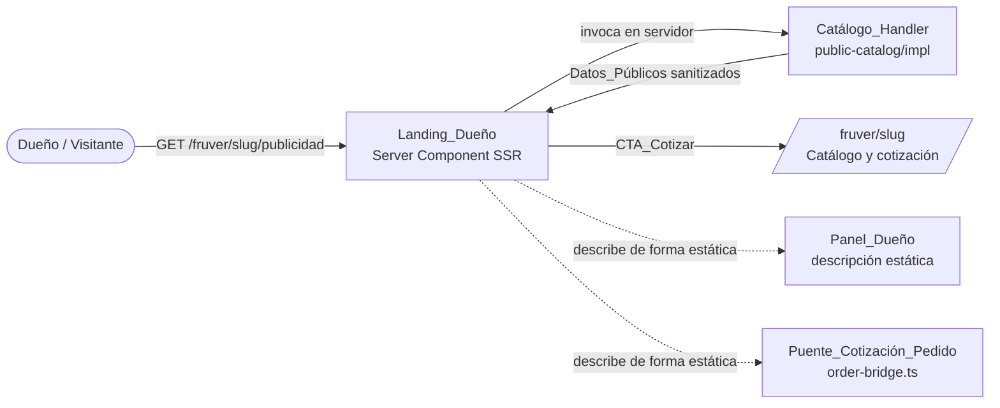
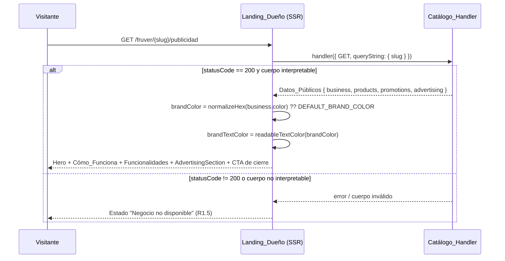
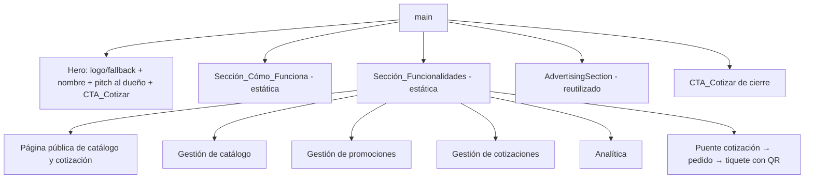
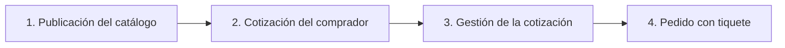

# Documento de Diseño — fruver-owner-landing

## Overview

Esta feature amplía la página existente `/fruver/[slug]/publicidad` para
convertirla en una **landing page detallada dirigida al dueño del negocio**
(la `Landing_Dueño`). La página deja de ser solo una mini-landing de marketing
hacia el comprador y pasa a **explicar en detalle las funcionalidades de
gestión** del vertical fruver, sin perder su naturaleza compartible ni su
capacidad de dirigir al catálogo para cotizar.

El diseño es deliberadamente de **reutilización primero**: no se crean endpoints
ni fuentes de datos nuevas. La página sigue siendo un **Server Component**
renderizado en SSR dinámico que:

- carga los `Datos_Públicos` invocando el `Catálogo_Handler` existente
  (`@/app/api/public-catalog/impl`) en el servidor (R1),
- aplica la marca del negocio con los helpers puros de `lib/fruver/brand.ts`
  (`normalizeHex`, `readableTextColor`, `DEFAULT_BRAND_COLOR`) (R2),
- reutiliza el componente compartido `AdvertisingSection` para las promociones y
  bloques de publicidad vigentes (R8, R9),
- añade **dos secciones explicativas estáticas** nuevas: `Sección_Cómo_Funciona`
  (R4) y `Sección_Funcionalidades` (R5, R6, R7),
- y genera metadatos compartibles a partir de los datos públicos (R11).

Todo el contenido nuevo es **explicativo y estático**: describe el
`Panel_Dueño` y el `Puente_Cotización_Pedido` (descrito por
`lib/fruver/order-bridge.ts`) sin consultar ni exponer datos operativos
privados. La página respeta el aislamiento por `business_id` porque resuelve el
negocio exclusivamente a través del `slug` recibido (R1.4).

### Decisiones de diseño clave

| Decisión | Rationale | Requisitos |
|---|---|---|
| Extender la página existente en lugar de crear una nueva ruta | La ruta `/fruver/[slug]/publicidad` ya está publicada y es compartible; conservar la URL evita romper enlaces y metadatos ya difundidos | R1, R11 |
| Mantener Server Component + `force-dynamic` | La publicidad refleja promociones vivas y catálogo diario; no debe cachearse | R1.1, R1.2 |
| Reutilizar `Catálogo_Handler` en vez de un endpoint nuevo | Reutilización primero; el handler ya devuelve la proyección pública sanitizada e impone el aislamiento por slug | R1.1, R1.3, R1.4 |
| Secciones nuevas 100% estáticas (contenido en el servidor, sin fetch adicional) | El contenido describe funcionalidades; no debe tocar datos privados del panel | R4.3, R5, R6, R7 |
| Reutilizar `brand.ts` y `AdvertisingSection` | Helpers puros ya probados y renderer compartido ya existente | R2, R8, R9 |

## Architecture

### Contexto del sistema



Las líneas continuas representan flujos de datos/navegación reales en tiempo de
ejecución. Las líneas punteadas representan **contenido descriptivo estático**:
la landing habla del `Panel_Dueño` y del `Puente_Cotización_Pedido` pero **no**
los invoca ni lee datos operativos privados (R4.3).

### Flujo de renderizado SSR



### Estructura de secciones de la página



### Capas y responsabilidades

- **Capa de ruta/SSR** (`app/fruver/[slug]/publicidad/page.tsx`): orquesta la
  carga de datos (`loadCatalog`), el cálculo de marca, el manejo del estado de
  error y la composición de secciones. Es la única pieza que cambia
  sustancialmente.
- **Capa de datos (reutilizada)**: `Catálogo_Handler`, sin cambios. Devuelve la
  proyección sanitizada e impone el aislamiento por slug.
- **Capa de marca (reutilizada)**: `lib/fruver/brand.ts`, helpers puros sin
  cambios.
- **Capa de presentación reutilizada**: `AdvertisingSection`.
- **Capa de presentación nueva (estática)**: subcomponentes de presentación para
  `Sección_Cómo_Funciona` y `Sección_Funcionalidades`. Son presentacionales, sin
  estado de cliente, seguros dentro de un Server Component.

## Components and Interfaces

### 1. `FruverAdvertisingPage` (Server Component — extendido)

Punto de entrada de la ruta. Responsabilidades:

- Resolver `slug` desde `params` y llamar a `loadCatalog(slug)`.
- Si no hay datos, renderizar el estado **"Negocio no disponible"** (R1.5).
- Calcular `brandColor` y `brandTextColor` con los helpers de marca (R2.1, R2.3).
- Componer, en orden: Hero → `Sección_Cómo_Funciona` → `Sección_Funcionalidades`
  → `AdvertisingSection` → CTA de cierre.

Se conserva la firma actual del componente y de `loadCatalog`/`generateMetadata`
(reutilización). El límite del componente es: *entra un `slug`, sale HTML SSR*.

### 2. `loadCatalog(slug)` (reutilizado, sin cambios)

Invoca el `Catálogo_Handler` en el servidor y devuelve `CatalogData | null`.
Devuelve `null` cuando el `statusCode` no es 200 o el cuerpo no es
interpretable, lo que dispara el estado de error (R1.5).

### 3. `generateMetadata({ params })` (extendido)

Construye título, descripción y Open Graph a partir de los `Datos_Públicos`
(R11.1, R11.2). Si no hay datos, produce metadatos de respaldo indicando que el
negocio no está disponible (R11.3). Se ajustan los textos para reflejar el nuevo
enfoque dirigido al dueño, manteniendo el logo en `openGraph.images` cuando
existe `logo_url`.

### 4. Hero (extendido)

Muestra logo o marcador de respaldo, nombre del negocio y una **presentación
breve dirigida al dueño** que posiciona la plataforma como herramienta de
gestión (R3.1, R3.2). Aplica `brandColor` de fondo y `brandTextColor` al texto
(R2.2, R2.3). Incluye un `CTA_Cotizar` hacia `/fruver/[slug]` (R3.3).

Manejo del logo:
- Con `logo_url`: `` con `alt` igual al nombre del negocio; se intenta
  cargar aunque falle, sin sustituir por el marcador (R2.4, R2.6).
- Sin `logo_url`: marcador visual de respaldo (R2.5).

### 5. `Sección_Cómo_Funciona` (subcomponente estático nuevo)

Bloque con encabezado propio (R4.1) que describe **de forma secuencial** el
flujo de extremo a extremo (R4.2): publicación del catálogo → cotización del
comprador → gestión de la cotización por el dueño → conversión en pedido con
tiquete. Contenido 100% estático (R4.3).



### 6. `Sección_Funcionalidades` (subcomponente estático nuevo)

Bloque con encabezado propio que agrupa las descripciones de gestión. Cada
subbloque es un contenedor de presentación con título y texto explicativo
estático:

- **Página pública de catálogo y cotización** (R5): marca del negocio, búsqueda
  de productos, total estimado, resumen persistente y estados vacíos; aclara que
  el total es **estimado** y lo confirma el negocio según disponibilidad y peso
  real (R5.2); e indica que la landing es una página de publicidad **compartible**
  (R5.3).
- **Gestión de catálogo** (R6.1): crear, editar y desactivar productos con foto.
- **Gestión de promociones** (R6.2): banners, combos y códigos con vigencia y
  porcentaje de descuento.
- **Gestión de cotizaciones** (R6.3): listar, marcar como convertidas y
  convertir en pedido.
- **Analítica** (R6.4): cotizaciones por semana, porcentaje de conversión,
  recompra y promedio del total estimado.
- **Puente cotización → pedido → tiquete con QR** (R7): describe la conversión de
  una cotización en un pedido con tiquete público (R7.1), que cada pedido incluye
  QR de seguimiento y link de entrega a domicilio (R7.2), y que **una cotización
  produce un único pedido** evitando duplicados (R7.3). Estas descripciones se
  corresponden con la lógica de `lib/fruver/order-bridge.ts`, pero la sección es
  puramente textual: no invoca el bridge ni consulta pedidos.

### 7. `AdvertisingSection` (reutilizado, sin cambios)

Renderiza promociones y bloques de publicidad vigentes, ocultando bloques vacíos
(R8.1, R8.2, R8.3) y mostrando la invitación a redes cuando existe (R9.1).

### 8. CTA de cierre (existente, con verificación de accesibilidad)

`CTA_Cotizar` de cierre hacia `/fruver/[slug]` con texto de acción explícito que
describe su destino (R9.2, R9.3).

### Accesibilidad transversal (R10)

Todos los subcomponentes deben cumplir:
- Indicador de foco visible en cada elemento interactivo (R10.1).
- `Contraste_AA` entre texto y fondo en todas las secciones, garantizado en las
  superficies de marca por `readableTextColor` (R10.2).
- Texto alternativo o etiqueta accesible en cada imagen y control (R10.3).
- Diseño móvil con áreas táctiles de ≥ 48 px de alto en los CTA (R10.4).

## Data Models

No se introducen modelos de datos nuevos ni persistencia. La página consume la
proyección pública ya sanitizada del `Catálogo_Handler`. Modelos relevantes
(reutilizados):

### `CatalogData` (proyección pública consumida por la página)

```ts
interface CatalogData {
  business: PublicBusiness;              // datos públicos del negocio
  products: PublicProduct[];             // catálogo público (no usado directamente por la landing)
  promotions: PublicPromotionAny[];      // promociones vigentes → AdvertisingSection
  advertising: AdvertisingBlocks;        // bloques compuestos → AdvertisingSection
}
```

### `PublicBusiness`

```ts
interface PublicBusiness {
  slug: string;          // identificador usado para resolver el negocio (R1.4)
  name: string;          // nombre mostrado en hero y metadatos
  color: string | null;  // color de marca (se normaliza con normalizeHex)
  logo_url: string | null; // logo opcional (hero + Open Graph)
}
```

### Contenido estático de secciones (modelo de presentación, no persistido)

El contenido explicativo se modela como estructuras de presentación estáticas
definidas en el propio componente (no proviene de datos):

```ts
// Modelo de presentación para pasos de "cómo funciona" y tarjetas de funcionalidades.
interface PasoComoFunciona { titulo: string; descripcion: string; }
interface TarjetaFuncionalidad { titulo: string; descripcion: string; }
```

Estos modelos son constantes en el servidor; **no** reflejan estado del negocio
ni datos operativos privados (R4.3).

### Aislamiento y datos sensibles

- El único dato de entrada que resuelve el negocio es `slug` (R1.4).
- Solo se renderizan los campos de la proyección sanitizada (R1.3).
- Ningún dato del `Panel_Dueño` se lee ni se expone; las secciones son estáticas.

## Correctness Properties

### Property 1: No aplica testing basado en propiedades (PBT) a esta feature

**Validates: Requirements 1.3, 1.5**

**No aplica testing basado en propiedades (PBT) a esta feature.**

Justificación: el trabajo nuevo de esta feature es (1) **renderizado de UI** de
secciones estáticas, (2) **composición de un Server Component** y (3) **carga de
datos vía un handler existente**. Ninguno de estos casos es adecuado para PBT
según la guía del workflow: no hay funciones puras nuevas con propiedades
universales que dependan de una amplia variedad de entradas.

La lógica pura subyacente ya está cubierta por sus propias features y no se
modifica aquí:
- `lib/fruver/brand.ts` (`normalizeHex`, `readableTextColor`, `contrastRatio`) —
  helpers puros ya verificables por propiedades en su spec de origen.
- `lib/fruver/order-bridge.ts` (`linesToItemsText`, `convertQuoteToOrder`,
  idempotencia) — lógica pura ya cubierta por propiedades en su spec de origen;
  esta landing solo la **describe** de forma estática.

Por lo tanto, se omite la validación por propiedades y se usan pruebas de ejemplo,
snapshot e integración (ver Testing Strategy).

## Error Handling

| Situación | Manejo | Requisito |
|---|---|---|
| `Catálogo_Handler` responde con estado ≠ 200 | `loadCatalog` devuelve `null`; la página renderiza el estado "Negocio no disponible" con mensaje explicativo | R1.5 |
| Cuerpo de respuesta no interpretable (JSON inválido) | `loadCatalog` captura el error de parseo y devuelve `null` → mismo estado de error | R1.5 |
| Color de marca inválido o ausente | `normalizeHex` devuelve `null` → se usa `DEFAULT_BRAND_COLOR` | R2.1 |
| Negocio sin `logo_url` | Se muestra el marcador visual de respaldo | R2.5 |
| `logo_url` presente pero la imagen falla al cargar | Se intenta mostrar la imagen sin sustituirla por el marcador (no hay handler de error que degrade a fallback) | R2.6 |
| Sin bloques de publicidad ni promociones vigentes | `AdvertisingSection` omite la sección sin mostrar bloques vacíos | R8.3 |
| Metadatos sin datos públicos disponibles | `generateMetadata` produce título/descripción de respaldo indicando negocio no disponible | R11.3 |

El estado de error es un renderizado degradado accesible (encabezado + mensaje),
no una excepción propagada; la página siempre responde con HTML válido.

## Testing Strategy

Enfoque dual adaptado a una feature de UI/SSR (sin PBT):

### Pruebas de ejemplo / unitarias (componente y metadatos)

- **Carga y estado de error**: con un `Catálogo_Handler` simulado que devuelve
  200, la página renderiza hero y secciones; con estado ≠ 200 o cuerpo inválido,
  renderiza "Negocio no disponible" (R1.1, R1.5).
- **Aislamiento por slug**: verificar que `loadCatalog` invoca el handler con el
  `slug` recibido y no con otro identificador (R1.4).
- **Marca**: con `color` válido, el hero usa el color normalizado; con `color`
  inválido/ausente, usa `DEFAULT_BRAND_COLOR`; el texto usa `readableTextColor`
  (R2.1, R2.2, R2.3).
- **Logo**: con `logo_url` se renderiza `` con `alt` = nombre; sin
  `logo_url` se renderiza el marcador de respaldo (R2.4, R2.5, R2.6).
- **Secciones estáticas**: `Sección_Cómo_Funciona` contiene los cuatro pasos en
  orden (R4.1, R4.2); `Sección_Funcionalidades` contiene los subbloques de
  catálogo público, gestión de catálogo, promociones, cotizaciones, analítica y
  puente cotización→pedido→tiquete con las afirmaciones clave (total estimado,
  QR + link de entrega, único pedido por cotización) (R5, R6, R7).
- **Metadatos**: con datos públicos, título/descripción derivados del negocio y
  logo en Open Graph cuando existe `logo_url`; sin datos, metadatos de respaldo
  (R11.1, R11.2, R11.3).
- **CTAs**: existen `CTA_Cotizar` en hero y cierre, ambos hacia `/fruver/[slug]`
  con texto de acción explícito (R3.3, R9.2, R9.3).

### Pruebas de snapshot (presentación)

- Snapshot del render con negocio con marca y con bloques de publicidad.
- Snapshot del estado "Negocio no disponible".
- Snapshot de la landing sin promociones (la sección de publicidad se omite,
  R8.3).

### Pruebas de accesibilidad (R10)

- Auditoría automática (p. ej. axe) sobre el render para detectar violaciones de
  contraste, etiquetas y roles (R10.2, R10.3).
- Verificación de estilos de foco visibles en elementos interactivos (R10.1).
- Verificación de altura mínima de 48 px en CTA para áreas táctiles (R10.4).
- Nota: la validación WCAG completa requiere pruebas manuales con tecnologías de
  asistencia y revisión experta; las pruebas automáticas cubren un subconjunto.

### Integración (reutilización del handler)

- 1–2 ejemplos representativos que ejerciten `loadCatalog` contra el
  `Catálogo_Handler` real para confirmar el contrato (`business`, `products`,
  `promotions`, `advertising`) y que solo se expone la proyección sanitizada
  (R1.1, R1.3).

Las pruebas de la lógica pura reutilizada (`brand.ts`, `order-bridge.ts`) no se
duplican aquí: ya están cubiertas por sus specs de origen.
