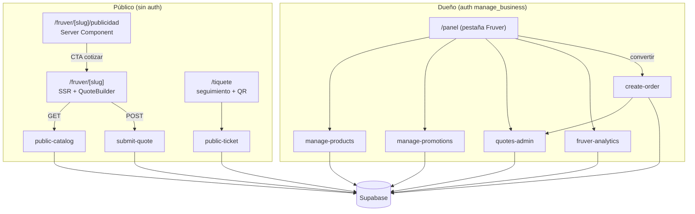

# Documento de Diseño: fruver-patty-experience

## Overview

Esta feature completa la experiencia de la vertical fruver para el piloto **Fruver Patty**, sobre la base ya construida en `fruver-catalog-quoting` (endpoints `public-catalog`, `submit-quote`, `manage-products`, `manage-promotions`, `quotes-admin`, `fruver-analytics`, módulos puros en `lib/fruver/*` y las tablas `products`, `promotions`, `quotes`, `frequent_lists`).

Se abordan cuatro frentes, todos reutilizando bloques existentes:

1. **Marca y UX** de `/fruver/[slug]` (logo, paleta, búsqueda, estados vacíos, accesibilidad).
2. **Página de publicidad** pública `/fruver/[slug]/publicidad`.
3. **Panel del Dueño** para fruver en `/panel` (catálogo, promociones, cotizaciones, analítica).
4. **Puente cotización → pedido** con tiquete y QR de seguimiento, reutilizando `create-order` y `/tiquete`.

### Principio rector: reutilizar, no reinventar

| Bloque existente | Archivo | Uso en esta feature |
|---|---|---|
| Página pública fruver | `app/fruver/[slug]/page.tsx`, `QuoteBuilder.tsx` | Base a mejorar (UX, marca, búsqueda) |
| Composición de publicidad | `lib/fruver/advertising.ts` (`buildAdvertisingBlocks`) | Alimenta catálogo y página de publicidad |
| Calculadora pura | `lib/fruver/quote-calculator.ts` | Total_Estimado local |
| Sanitización pública | `lib/fruver/sanitize.ts` | Datos públicos sin fugas |
| Catálogo público (GET) | `app/api/public-catalog/impl.ts` | SSR de catálogo y publicidad |
| Cotizaciones panel | `app/api/quotes-admin/impl.ts` | Listar / marcar convertida / enlazar `order_id` |
| Gestión de datos fruver | `manage-products`, `manage-promotions`, `fruver-analytics` | Vistas de panel |
| Motor de pedidos | `app/api/create-order/impl.ts` | Crear pedido con `ticket_token` desde cotización |
| Tiquete público + QR | `app/tiquete/*`, `qrcode.react`, `app/api/public-ticket` | Seguimiento del domicilio |
| Entrega a domicilio | `app/api/delivery-confirm`, `app/entrega/*` | Confirmación de entrega |
| Tema de marca | `lib/brand-theme.ts` | Aplicar color del negocio |

## Architecture



### Enfoque de rutas

- Página de publicidad como **subruta** de la vertical: `app/fruver/[slug]/publicidad/page.tsx` (Server Component). Reutiliza el mismo `public-catalog` handler para obtener negocio + `advertising`.
- El panel de fruver se integra en `app/panel` como una **sección/pestaña condicional** que aparece cuando el negocio pertenece a la vertical fruver (se detecta por la config del negocio ya cargada en el panel). Para mantener el `page.tsx` del panel manejable, la UI de fruver vive en componentes dedicados bajo `app/panel/fruver/` importados por el panel.

### Decisiones de diseño

1. **Publicidad como subruta, no dominio nuevo.** Mantiene el aislamiento por `slug` y reutiliza el handler y la sanitización existentes; el SEO/compartir se cubre con `generateMetadata`.
2. **Puente cotización→pedido del lado del panel (cliente) llamando a `create-order`.** No se crea un endpoint nuevo: el panel construye el payload de `create-order` desde las líneas de la cotización (mapeando a `itemsText`/`items`) y luego llama a `quotes-admin` `mark-converted` con el `order_id` devuelto. Esto evita lógica duplicada y respeta permisos existentes. Se añade idempotencia: si la cotización ya tiene `order_id`, no se vuelve a crear.
3. **Descripción de ítems legible.** Se construye `itemsText` a partir de las líneas (`"2 kg Tomate, 3 unidad Aguacate"`) para que el tiquete y el WhatsApp existentes funcionen sin cambios.
4. **Marca y accesibilidad centralizadas.** El cálculo de contraste de texto sobre `business.color` se encapsula en un helper puro reutilizable, para poder testearlo por propiedades sin DOM.
5. **Búsqueda y estados vacíos en el cliente.** El filtrado por nombre ocurre en `QuoteBuilder` (ya recibe todos los productos), sin round-trips ni endpoints nuevos.

## Components and Interfaces

### Helper de contraste de marca — `lib/fruver/brand.ts` (módulo puro)

```ts
// Devuelve "#ffffff" o "#0f172a" según el mejor contraste sobre el color de fondo.
export function readableTextColor(bgHex: string): "#ffffff" | "#0f172a";

// Normaliza un hex (#rgb o #rrggbb) a #rrggbb en minúsculas; null si inválido.
export function normalizeHex(input: string | null | undefined): string | null;
```

Usado por el hero del catálogo y de la página de publicidad para garantizar contraste AA (R1.3, R1.4).

### Filtro de catálogo — dentro de `QuoteBuilder.tsx`

```ts
// Filtra productos por coincidencia de nombre (case/acento-insensible).
function filterProducts(products: PublicProduct[], query: string): PublicProduct[];
```

Función pura extraíble a `lib/fruver/search.ts` para test (R2.1, R2.5).

### Página de publicidad — `app/fruver/[slug]/publicidad/page.tsx`

- Server Component. Llama al `public-catalog` handler (mismo patrón que `page.tsx`).
- Renderiza: hero con logo/nombre/color de marca (R3.1), bloques de publicidad vía `AdvertisingSection` reutilizable (R3.2), invitación social (R3.3) y CTA "Cotizar ahora" → `/fruver/[slug]` (R3.4).
- `export async function generateMetadata()` con título/descripción del negocio (R3.6).
- Solo datos sanitizados que ya entrega `public-catalog` (R3.5, R8.1).

### Componente reutilizable de publicidad — `app/fruver/[slug]/AdvertisingSection.tsx`

Se extrae el `AdvertisingSection` actualmente embebido en `QuoteBuilder.tsx` a un componente compartido para que catálogo y página de publicidad lo usen sin duplicación.

### Panel del Dueño (fruver) — `app/panel/fruver/`

Componentes cliente que usan los helpers de `lib/client.ts` (`apiPostJSON`, `getStoredToken`, `money`) y `qrcode.react`:

- `CatalogManager.tsx` — CRUD de productos vía `manage-products` (list/create/update/deactivate) (R4).
- `PromotionsManager.tsx` — CRUD de promociones vía `manage-promotions` (R5).
- `QuotesPanel.tsx` — lista de cotizaciones (`quotes-admin` `list`), acción "Convertir en pedido" y "Marcar convertida" (R6, R7).
- `FruverAnalytics.tsx` — métricas vía `fruver-analytics` (R6.3).

El `app/panel/page.tsx` detecta la vertical (por la config ya cargada) y, si es fruver, muestra una pestaña "Fruver" que monta estos componentes. No se altera el flujo de lavandería existente.

### Puente cotización → pedido — `app/panel/fruver/convertQuote.ts` (cliente)

```ts
interface ConvertQuoteInput {
  quote: QuoteRecord;          // incluye lines, estimated_total, order_id?
  businessId: string;
  businessSlug: string;
  customerName: string;
  customerPhone: string;       // obligatorio (R7.5)
  customerAddress?: string;
}

// 1) Si quote.order_id ya existe -> retorna sin crear (idempotencia, R7.3).
// 2) POST /api/create-order con itemsText derivado de las líneas y total = estimated_total.
// 3) POST /api/quotes-admin mark-converted con { quote_id, order_id } (R7.3, R6.2).
async function convertQuoteToOrder(input: ConvertQuoteInput): Promise<{ orderNumber: string; ticketUrl: string }>;
```

`itemsText` se arma con un helper puro:

```ts
// "2 kg Tomate, 3 unidad Aguacate"
export function linesToItemsText(lines: QuoteLine[]): string;
```

### Seguimiento a domicilio + QR

Se reutiliza sin cambios:
- `create-order` genera `ticket_token` y el pedido queda consultable en `/tiquete?number=...&slug=...`.
- El QR se genera con `QRCodeSVG` (patrón ya presente en `app/panel/page.tsx`).
- La confirmación de entrega usa `delivery-confirm` + `/entrega` existentes.

## Data Models

No se introducen tablas nuevas. La columna `orders.customer_address` (o `custom_fields.direccion`) se usa para el domicilio según el patrón vigente en el panel.

- Migración aditiva **solo si es necesaria**: asegurar `logo_url` en `businesses` (si no existiera). Debe ser `ADD COLUMN IF NOT EXISTS logo_url TEXT`, idempotente, sin tocar RLS (R8.4). Se verifica antes de crearla.
- El logo de Fruver Patty se sirve como archivo estático en `public/icons/fruver-patty.png` (o `.svg`) y se asigna a `businesses.logo_url` del negocio piloto mediante el seed `scripts/seed-fruver-patty.mjs` (R1.5).

## Correctness Properties

*Una propiedad es una afirmación que debe cumplirse en toda ejecución válida. Se centran en los módulos puros nuevos, único código amenable a testing por propiedades en esta feature.*

### Property 1: Contraste de texto legible sobre el color de marca

*Para todo* color de fondo hex válido, `readableTextColor` devuelve `#ffffff` o `#0f172a` eligiendo el que maximiza el contraste, y el par (fondo, texto) cumple una razón de contraste ≥ 4.5:1 siempre que exista una opción que la cumpla.

**Validates: Requirements 1.3, 1.4**

### Property 2: Normalización idempotente de hex

*Para todo* string, `normalizeHex` devuelve `null` para entradas inválidas y un `#rrggbb` en minúsculas para válidas; aplicar `normalizeHex` dos veces produce el mismo resultado que aplicarla una vez.

**Validates: Requirements 1.3**

### Property 3: Filtro de catálogo por nombre

*Para todo* catálogo y consulta, `filterProducts` devuelve un subconjunto del catálogo donde cada resultado contiene la consulta normalizada (sin distinguir mayúsculas/acentos), y con consulta vacía devuelve el catálogo completo.

**Validates: Requirements 2.1, 2.5**

### Property 4: Descripción de ítems completa y legible

*Para toda* lista de líneas de cotización válidas, `linesToItemsText` produce un texto que contiene el nombre, la cantidad y la unidad de cada línea, sin omitir líneas.

**Validates: Requirements 7.1**

### Property 5: Idempotencia de la conversión de cotización

*Para toda* cotización que ya tiene `order_id`, `convertQuoteToOrder` no crea un pedido nuevo (no se invoca `create-order`), preservando un único pedido por cotización.

**Validates: Requirements 7.3**

## Error Handling

Sigue el patrón vigente del repositorio: los handlers devuelven `json(status, { error, message, field? })`; las vistas de panel muestran toasts/mensajes ante errores de red o autorización y degradan sin romper la UI (R8.5). La conversión de cotización valida teléfono obligatorio antes de llamar a `create-order` (R7.5) y trata el caso de cotización ya convertida (R7.3).

## Testing Strategy

- **Property tests (fast-check, ≥100 iteraciones)** para los módulos puros nuevos: `brand.ts` (Props 1, 2), `search.ts` (Prop 3), `linesToItemsText` (Prop 4) y la guarda de idempotencia de `convertQuoteToOrder` con `create-order` mockeado (Prop 5).
- **Pruebas de ejemplo (Vitest)** para el puente cotización→pedido: payload correcto a `create-order`, y `mark-converted` con `order_id`.
- **Verificación manual** de accesibilidad (foco, contraste) y de SSR de las páginas públicas; la validación WCAG completa requiere pruebas con tecnologías asistivas y revisión experta.
- Etiqueta de propiedades: "Feature: fruver-patty-experience, Property {número}".
